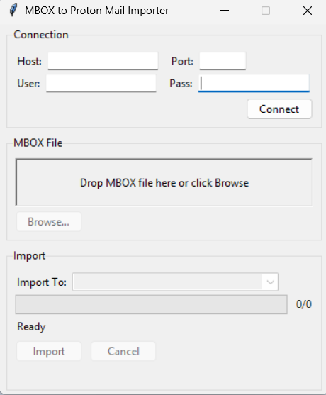

# MBOX to Proton Mail Importer

A simple GUI tool to import MBOX email archives into Proton Mail via [Proton Mail Bridge](https://proton.me/mail/bridge). Built because Thunderbird's import kept failing and losing progress on large mailboxes.

This was vibe-coded with [Claude](https://claude.ai).



## Features

- **Resume capability** — if the import fails or you cancel, it picks up where it left off
- **Drag & drop** — drop your MBOX file onto the window (requires `tkinterdnd2`, falls back to file browser)
- **Remembers credentials** — connection settings saved locally so you don't re-enter them each launch
- **Flag preservation** — converts mbox Status/X-Status headers to IMAP flags (`\Seen`, `\Flagged`, etc.)
- **Date preservation** — original email dates are kept via IMAP INTERNALDATE
- **Graceful error handling** — skips malformed or oversized (>25MB) messages, reconnects on connection drops

## Requirements

- Python 3.10+
- [Proton Mail Bridge](https://proton.me/mail/bridge) running on your machine

## Install

```bash
pip install tkinterdnd2
```

`tkinterdnd2` is optional — without it you just lose drag & drop and use the file browser instead.

## Usage

1. Start Proton Mail Bridge and note the Bridge password (not your account password)
2. Run the importer:
   ```bash
   python importer.py
   ```
3. Enter your connection details (default `127.0.0.1:1143`), click **Connect**
4. Drop or browse to your `.mbox` file
5. Pick the target folder, click **Import**

If something goes wrong mid-import, just reopen the app — it'll detect the saved progress and offer to resume.

## Compatibility

Tested on Windows 11. Should work on macOS and Linux as well — everything is cross-platform Python stdlib + tkinter.

On Linux, drag & drop may require the `tkdnd` system package (`sudo apt install tkdnd` on Debian/Ubuntu). Without it the app still works, you just use the file browser instead.

## License

MIT — see [LICENSE](LICENSE).
